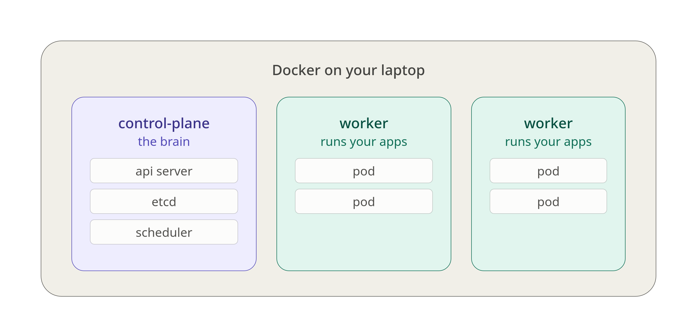

# k8-kind-learning

## What a cluster is

The set of machines Kubernetes runs on. Each machine is a node. Nodes come in two roles:

- Control plane — the brain. Stores the desired state, makes decisions. Doesn't run your apps.
- Worker — runs your actual containers.

## What kind does

kind = Kubernetes IN Docker. It fakes each node with a Docker container. So a "3-node cluster" is 3 containers on your laptop, and your app containers run inside those containers.

## Useful commands

| Use                      | Command                                             | Notes |
| ------------------------ | --------------------------------------------------- | ----- |
| Create Cluster from yaml | kind create cluster --config kind-config.yaml       |       |
| View Clusters            | kubectl config get-clusters                         |       |
| Delete pod               | kubectl delete pod <podname>                        |       |
| Rollout restart          | kubectl rollout restart deployment/<deploymentname> |       |
