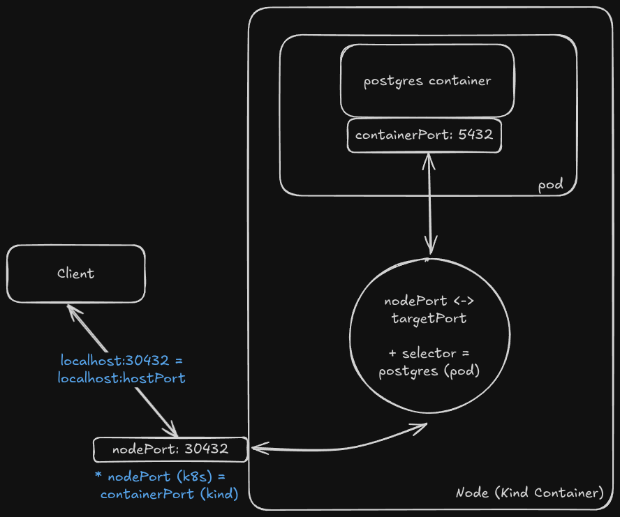

# postgres example <!-- omit from toc -->

## Table of Contents <!-- omit from toc -->
- [Cluster Setup](#cluster-setup)
- [Deployment Setup](#deployment-setup)
- [NodePort Setup](#nodeport-setup)
  - [Cluster configuration](#cluster-configuration)
  - [Kubernetes configuration](#kubernetes-configuration)
  - [Diagram](#diagram)
- [Connecting to Postgres](#connecting-to-postgres)
- [Test Data](#test-data)
  - [Adding](#adding)
  - [Deleting](#deleting)
- [Persistent Data](#persistent-data)
  - [Persistent Volume Claim](#persistent-volume-claim)

## Cluster Setup

See: [postgres-cluster.yaml](../clusters/postgres-cluster.yaml)

- single node setup
- control plane + app on same node
- kind creates a container for each "node" in kubernetes, they are 1:1

## Deployment Setup

See: [postgres-deployment.yaml](../apps/postgres-deployment.yaml)

- need to define the `POSTGRES_PASSWORD` at the bare minimun, otherwise the postgres pod will fail
- need to also define the `containerPort:5342` which maps to the port that postgres application is listening on 

## NodePort Setup 

### Cluster configuration

```yaml
    extraPortMappings: # this enables nodeports
      - containerPort: 30432 # The port the application listens on inside the container.
        hostPort: 30432 #  The port exposed on the outside (your physical computer)
        protocol: TCP
```

To make a NodePort service work in kind, you must link the two systems together by matching specific ports:

1. The Kind Bridge (`hostPort` → `containerPort`): Controlled by your kind-config.yaml.It opens a port on your laptop and forwards it to the Docker container running Kubernetes.

2. The Kubernetes Link (`nodePort` → `port` → `targetPort`): Controlled by your Service YAML.
   
3. The Magic Connection: You must make `containerPort` (in kind) exactly equal to nodePort (in Kubernetes).

### Kubernetes configuration

A NodePort exposes a port on every node in the cluster. A client will access it via `<NodeIP>:<NodePort>`

```yaml
apiVersion: v1
kind: Service
metadata:
  name: postgres-nodeport-service
spec:
  type: NodePort
  selector:
    app: postgres
  ports:
    - port: 5432       # Port used internally by other cluster services
      targetPort: 5432 # Port the PostgreSQL container is listening on
      nodePort: 30432  # External port opened on every Kubernetes node
```

- `nodePort` is the port used by external apps/clients outside of the cluster to access the service
- `port` is the port used by internal apps within the cluster to access the service
- `targetPort` is the port that the service routes traffic to for the app defined

### Diagram



## Connecting to Postgres

`psql -h localhost -p 30432 -d non_default_postgres -U not_default_postgres`

- we can use localhost since we map `hostPort:30432` to `containerPort:30432` in the kind config
  - this maps the localhost:30423 to the container (node) in the kind cluster


## Test Data

### Adding 

```sql
CREATE TABLE users (
    id         SERIAL PRIMARY KEY,
    name       TEXT NOT NULL,
    email      TEXT UNIQUE,
    age        INT,
    active     BOOLEAN DEFAULT true,
    created_at TIMESTAMPTZ DEFAULT now()
);

INSERT INTO users (name, email, age) VALUES ('Alice', 'alice@example.com', 30);

INSERT INTO users (name, email, age) VALUES
    ('Bob',  'bob@example.com',  25),
    ('Cara', 'cara@example.com', 41);

SELECT * FROM users;
```

### Deleting

```sql
DROP TABLE users;
```

## Persistent Data

With a basic deployment setup, every time the pod dies or gets rolledout, all of its data is deleted along with the pod

### Persistent Volume Claim

A Kubernetes resource that creates a "claim" to persistent volume space. When definining a volume for a container, you would map it to the PVC. You must also define your volumeMounts.

Also notice, that we must change the default strategy from `RollingUpdate` to `Recreate` so that new pods dont try connect to the volume while the old one is still connected. 

```yaml
apiVersion: v1
kind: PersistentVolumeClaim
metadata:
  name: postgres-pvc
spec:
  accessModes:
  - ReadWriteOnce
  resources:
    requests:
      storage: 1Gi
  storageClassName: standard
```

```yaml
apiVersion: apps/v1
kind: Deployment
metadata:
  name: postgres-deployment
  labels:
    app: postgres
spec:
  replicas: 1
  strategy:
    type: Recreate # we need recreate here over rolling since the old and new pod might both try to connect to the same pvc
  selector:
    matchLabels:
      app: postgres
  template:
    metadata:
      labels:
        app: postgres
    spec:
      containers:
      - name: postgres
        image: postgres:16-alpine
        ### ...
        volumeMounts:
        - name: postgres-storage
          mountPath: /var/lib/postgresql/data
      volumes:
      - name: postgres-storage
        persistentVolumeClaim:
          claimName: postgres-pvc
```